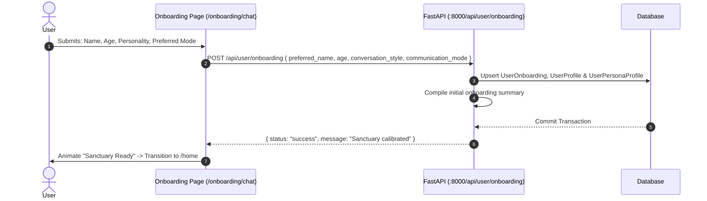
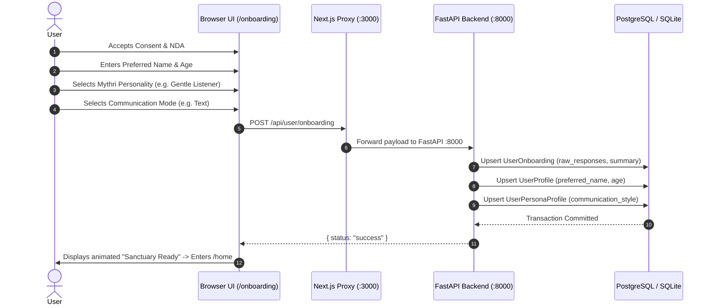
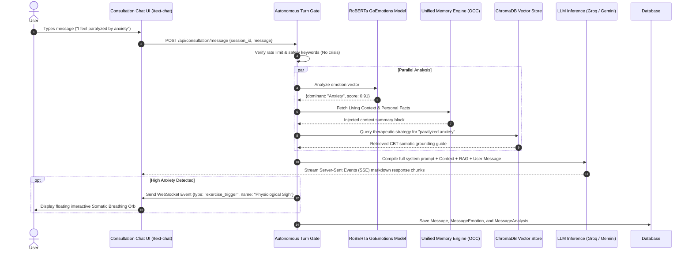
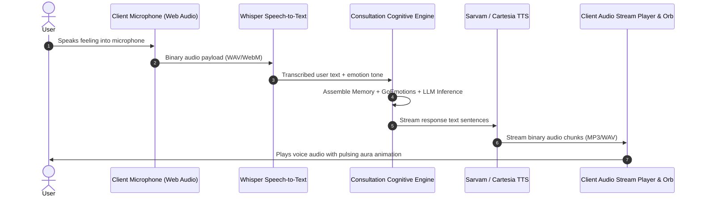
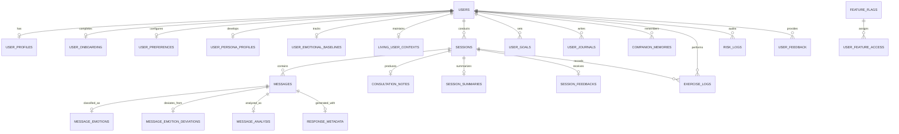

# 🏛️ MYTHRI: ENTERPRISE SYSTEM ARCHITECTURE & TECHNICAL SPECIFICATION REPORT

```
========================================================================================
DOCUMENT TITLE:       Mythri Autonomous Psychological Companion & Regulation Architecture
DOCUMENT VERSION:     5.2.0 (Enterprise Edition)
CLASSIFICATION:       Technical Architecture & Executive Engineering Specification
DATE OF RELEASE:      September 2026
AUTHORS & ARCHITECTS: Affyne Labs Engineering & Clinical AI Architecture Group
TARGET AUDIENCE:      Executive Leadership, Technical Review Boards, Clinical Advisors
========================================================================================
```

---

## 📑 TABLE OF CONTENTS
1. [Executive Summary (Non-Technical & Strategic Overview)](#1-executive-summary)
2. [Clinical Philosophy & AI Foundation](#2-clinical-philosophy--ai-foundation)
3. [Master Multi-Tier System Architecture Diagram](#3-master-system-architecture)
4. [Comprehensive Module-by-Module Technical Deep Dive](#4-module-deep-dives)
   - [4.1 Client Experience & Presentation Tier](#41-client-experience--presentation-tier)
   - [4.2 Security, Authentication & Onboarding Gateway](#42-security-auth--onboarding-gateway)
   - [4.3 Consultation Engine & Autonomous Turn Gate](#43-consultation-engine--autonomous-turn-gate)
   - [4.4 Neuro-Cognitive Emotion & Baseline Shift Engine](#44-neuro-cognitive-emotion--baseline-shift-engine)
   - [4.5 Real-Time Multimodal Voice Sanctuary Pipeline](#45-real-time-multimodal-voice-pipeline)
   - [4.6 Retrieval-Augmented Generation (RAG) & Vector Intelligence](#46-rag--vector-intelligence)
   - [4.7 Dual-Channel Long-Term Memory & Living Context (OCC)](#47-dual-channel-memory--living-context)
   - [4.8 Somatic & Cognitive Grounding Sanctuary](#48-somatic--cognitive-grounding-sanctuary)
   - [4.9 Emotional Progress & Trajectory Analytics](#49-emotional-progress--trajectory-analytics)
   - [4.10 Past Reflections & Clinical Note Generation](#410-past-reflections--clinical-notes)
   - [4.11 Sanctuary Profile & Dynamic Persona Calibration](#411-sanctuary-profile--persona-calibration)
   - [4.12 Experience Feedback & Terminal Command Center Telemetry](#412-feedback--telemetry)
5. [End-to-End Data Flow Journeys (Sequence & State Flows)](#5-end-to-end-data-flows)
   - [Journey A: User Onboarding & Identity Calibration](#journey-a-onboarding)
   - [Journey B: Text Consultation & Live Adaptive Response](#journey-b-text-consultation)
   - [Journey C: Real-Time Streaming Voice Pipeline](#journey-c-voice-pipeline)
   - [Journey D: Somatic Exercise Trigger & Outcome Logging](#journey-d-somatic-exercises)
   - [Journey E: Post-Session Memory Consolidation](#journey-e-memory-consolidation)
   - [Journey F: Deterministic Crisis Intervention & Safety Interceptor](#journey-f-crisis-safety)
6. [Database Architecture & Entity-Relationship Model (ERD)](#6-database-architecture--erd)
7. [Security, Clinical Governance & Compliance](#7-security--compliance)
8. [Technology Stack Matrix](#8-technology-stack-matrix)

---

<a name="1-executive-summary"></a>
## 1. 🌟 Executive Summary (Non-Technical & Strategic Overview)

### What is Mythri?
**Mythri** is an autonomous, emotionally intelligent therapeutic companion designed to provide evidence-based psychological support, nervous system regulation, and continuous emotional recovery tracking.

### The Problem it Solves:
Traditional mental health apps are either static symptom trackers or generic chatbots that treat user distress as generic text. They lack:
1. **Clinical empathy & regional nuance** (struggles with Indian cultural context and regional languages).
2. **Physiological & somatic awareness** (cannot guide users out of active panic states).
3. **Long-term living memory** (they forget previous conversations).
4. **Objective mathematical tracking of recovery** (unable to measure if a user is truly calming down).

### How Mythri Works in 4 Steps (Plain English):

```
┌────────────────────────────────────────────────────────────────────────────────────────┐
│                                HOW MYTHRI OPERATES                                     │
├───────────────────┬───────────────────┬─────────────────────────┬──────────────────────┤
│ 1. YOU SPEAK/TYPE │ 2. MYTHRI SENSES  │ 3. MYTHRI REMEMBERS     │ 4. EMOTIONAL SHIFT   │
│ Natural text or   │ RoBERTa neural net│ Pulls your living       │ Measures your        │
│ voice in English, │ classifies your   │ context, ongoing goals, │ baseline calm score  │
│ Hindi, Telugu, or │ feeling across 28 │ and evidence-based CBT/ │ before vs after the  │
│ Tamil.            │ clinical emotions.│ somatic strategies.     │ consultation.        │
└───────────────────┴───────────────────┴─────────────────────────┴──────────────────────┘
```

---

<a name="2-clinical-philosophy--ai-foundation"></a>
## 2. 🧠 Clinical Philosophy & AI Foundation

Mythri's architecture is rooted in proven therapeutic frameworks:

1. **Polyvagal Theory & Somatic Regulation:** Recognizes that cognitive dialogue alone cannot resolve high physiological arousal. Mythri uses real-time bio-behavioral pacing (e.g., Physiological Sighs, Box Breathing) to stimulate the vagus nerve and down-regulate the sympathetic nervous system.
2. **Cognitive Behavioral Therapy (CBT) & Reframing:** Identifies cognitive distortions (catastrophizing, all-or-nothing thinking, emotional reasoning) and offers structured cognitive reframes.
3. **Dialectical Behavior Therapy (DBT) & Distress Tolerance:** Uses sensory grounding (5-4-3-2-1 technique, temperature shifts, body scans) for acute overwhelm.
4. **Bayesian Emotional Baseline Theory:** Formulates emotional states not as single labels, but as continuous 28-dimensional probability distributions evaluated using **Jensen-Shannon Divergence ($JSD$)**.

---

<a name="3-master-system-architecture"></a>
## 3. 🗺️ Master Multi-Tier System Architecture Diagram

```mermaid
flowchart TB
    subgraph TIER1["1. CLIENT PRESENTATION TIER (Browser & Native Shell)"]
        UI_Home["Dashboard (/home)"]
        UI_TextChat["Text Consultation (/text-chat)"]
        UI_VoiceChat["Voice Sanctuary (/voice-chat)"]
        UI_Progress["Baseline Shift Analytics (/progress)"]
        UI_Exercises["Grounding Sanctuary (/exercises)"]
        UI_History["Past Reflections (/history)"]
        UI_Profile["Sanctuary Profile (/profile)"]
        UI_Onboard["3-Step Onboarding (/onboarding)"]
    end

    subgraph TIER2["2. EDGE ROUTING & REWRITE PROXY (Next.js 16 - Port 3000)"]
        EdgeProxy["Next.js Route Guard & Proxy (proxy.ts)"]
        ApiRewrites["API Proxy Rewrites (/api/* -> FastAPI :8000)"]
        ThemeContext["Theme & Aesthetic Provider"]
    end

    subgraph TIER3["3. APPLICATION GATEWAY & SERVICES (FastAPI - Port 8000)"]
        AuthRouter["Authentication & JWT Service (/api/auth)"]
        ConsultRouter["Consultation Service (/api/consultation)"]
        VoiceRouter["Voice Pipeline Service (/api/voice)"]
        ProgressRouter["Baseline Analytics Service (/api/consultation/progress)"]
        UserRouter["Profile & Onboarding Service (/api/user)"]
        FeedbackRouter["Feedback & Quality Service (/api/feedback)"]
        AdminRouter["Telemetry & Audit Service (/api/admin)"]
    end

    subgraph TIER4["4. COGNITIVE AI & NEURAL INFERENCE ENGINE"]
        TurnGateSupervisor["Autonomous Turn Gate & Crisis Interceptor"]
        EmotionRoBERTa["GoEmotions 28-Vector Neural Classifier"]
        BaselineJSD["Jensen-Shannon Divergence Baseline Engine"]
        MemoryUnified["Unified Memory & OCC Context Assembler"]
        VectorRAG["ChromaDB Vector Retrieval Engine"]
        LLMInference["LLM Orchestrator (Groq / Llama-3.3 / Gemini)"]
        VoicePipeline["STT (Whisper) + TTS (Sarvam / Cartesia / Kokoro)"]
    end

    subgraph TIER5["5. PERSISTENCE & DATA STORAGE TIER (Neon PostgreSQL / SQLite)"]
        DB_Identity[("Users, Profiles & Persona Profiles")]
        DB_Sessions[("Sessions, Messages & Transcripts")]
        DB_Emotions[("Emotions, Baselines & Deviations")]
        DB_Memory[("Living Contexts & Companion Memories")]
        DB_Exercises[("Exercise Logs & Clinical Notes")]
        DB_Audit[("Risk Logs, Feedback & Telemetry")]
    end

    TIER1 --> TIER2
    TIER2 --> TIER3
    TIER3 --> TIER4
    TIER3 --> TIER5
    TIER4 --> TIER5
```



---

<a name="4-module-deep-dives"></a>
## 4. 🔍 Comprehensive Module-by-Module Technical Deep Dive

---

### 4.1 Client Experience & Presentation Tier
- **Location:** `frontend/app/`, `frontend/modules/`, `frontend/shared/`
- **Core Technologies:** Next.js 16 (App Router), React 19, Tailwind CSS v4, Framer Motion v12, Lucide Icons, Web Audio API.
- **Functionality:** Provides a unified, accessible, glassmorphic UI. Renders dynamic fluid navigation docks (`RadialNav.tsx`), animated breathing orbs (`MythriAura.tsx`), real-time text streaming bubbles with Markdown support, interactive SVG trajectory charts, and tactile audio controls.
- **Data Flow:** Captures user keystrokes, button taps, and microphone audio streams; formats requests into JSON or FormData; listens to Server-Sent Events (SSE) and WebSocket side-channels.

---

### 4.2 Security, Authentication & Onboarding Gateway
- **Location:** `frontend/modules/authentication/`, `frontend/modules/onboarding/`, `backend/security/authentication/`
- **Core Technologies:** Firebase Authentication SDK, PyJWT, Passlib (Bcrypt), HttpOnly Secure Cookies.
- **Functionality:** 
  - Validates user identity via Email/Password or Google One-Tap.
  - Generates secure JWT access tokens (`mb_token`).
  - Conducts a focused 3-step onboarding flow:
    1. **Consent & Privacy:** Legal eligibility, NDA confidentiality, encrypted data handling.
    2. **Identity & Age:** Preferred name and age bracket (essential for clinical age-adapted models).
    3. **Mythri Personality & Channel:** *Gentle Listener*, *Supportive Friend*, *Thought Partner*, *Practical Coach* + *Text/Voice/Both*.
- **Database Tables Touched:** `users`, `user_profiles`, `user_onboarding`, `user_persona_profiles`.



---

### 4.3 Consultation Engine & Autonomous Turn Gate
- **Location:** `backend/modules/consultation/api.py`, `backend/modules/consultation/turn_gate.py`
- **Core Technologies:** FastAPI StreamingResponse, Server-Sent Events (SSE), Regular Expression Safety Filters, AsyncIO.
- **Functionality:**
  - **Turn Gate:** Pre-validates incoming text, checks message integrity, and executes a deterministic **Safety & Crisis Interceptor**. If acute crisis keywords (self-harm, suicide, extreme violence) are present, it aborts normal LLM generation, logs to `risk_logs`, and immediately returns verified emergency helplines (112, AASRA, Vandrevala Foundation).
  - **Context Integration:** Queries the Unified Memory and RAG vector store to assemble the final clinical prompt.
  - **Streaming:** Streams chunked markdown responses token-by-token directly to the client interface.
- **Database Tables Touched:** `sessions`, `messages`, `message_analysis`, `response_metadata`.

---

### 4.4 Neuro-Cognitive Emotion & Baseline Shift Engine
- **Location:** `backend/ai_engine/emotion_baseline_engine.py`, `backend/rag/brain/emotion_detector.py`
- **Core Technologies:** RoBERTa transformer (`SamLowe/roberta-base-go_emotions`), PyTorch, SciPy (Jensen-Shannon Divergence).
- **Mathematical Mechanics:**
  1. **28-Emotion Probability Vector:** For user message $M$, RoBERTa produces probability distribution $P(x)$ across 28 emotions:
     $$\sum_{i=1}^{28} P(e_i) = 1$$
  2. **Rolling Personal Baseline:** The user's baseline $Q(x)$ is stored in `user_emotional_baselines`.
  3. **Jensen-Shannon Divergence ($JSD$):** Measures emotional deviation from baseline:
     $$M = \frac{1}{2}(P + Q)$$
     $$JSD(P \parallel Q) = \frac{1}{2} D_{KL}(P \parallel M) + \frac{1}{2} D_{KL}(Q \parallel M)$$
     Where $D_{KL}$ is the Kullback-Leibler divergence:
     $$D_{KL}(P \parallel M) = \sum_{i=1}^{28} P(e_i) \log_2 \left(\frac{P(e_i)}{M(e_i)}\right)$$
  4. **Baseline Shift Score:** Transforms deviation into an intuitive $15 - 100$ point calmness scale.
- **Database Tables Touched:** `message_emotions`, `user_emotional_baselines`, `message_emotion_deviations`.

---

### 4.5 Real-Time Multimodal Voice Sanctuary Pipeline
- **Location:** `backend/modules/voice/api.py`, `backend/modules/voice/vocal_engine.py`
- **Core Technologies:** OpenAI Whisper STT, Sarvam AI Regional TTS (Bulbul), Cartesia / Kokoro Ultra-Low Latency TTS, Web Audio API.
- **Functionality:**
  - Converts user voice to text in $<400\text{ms}$.
  - Sends text through the Clinical Consultation Engine.
  - Streams synthetic audio back chunk-by-chunk for simultaneous playback while the model is still generating words.
  - Synchronizes client visualizer orb to audio frequency data.
- **Database Tables Touched:** `sessions` (`channel='voice'`), `messages`.

---

### 4.6 Retrieval-Augmented Generation (RAG) & Vector Intelligence
- **Location:** `backend/rag/brain/analyst.py`, `backend/rag/knowledge/chroma_db/`
- **Core Technologies:** ChromaDB Vector Database, Sentence Transformers (`all-MiniLM-L6-v2`), Recursive Character Text Splitters.
- **Functionality:**
  - Stores clinical psychology handbooks, CBT thought records, grounding exercises, and coping mechanisms.
  - Uses cosine similarity to retrieve the top-3 most clinically relevant therapeutic strategies for the user's specific presenting problem.
  - Injects retrieved context into the hidden system prompt to ensure therapeutic accuracy.

---

### 4.7 Dual-Channel Long-Term Memory & Living Context (OCC)
- **Location:** `backend/modules/memory/unified_context.py`, `backend/modules/memory/incremental_updater.py`
- **Core Technologies:** SQLAlchemy OCC (Optimistic Concurrency Control with `version_id_col`), Background Worker Tasks.
- **Functionality:**
  - **Episodic Memory (`companion_memories`):** Extracts key user facts (e.g., "User is preparing for medical exams", "User has conflict with brother Rahul").
  - **Living User Context (`living_user_contexts`):** Maintains a continuously updated compressed narrative of ongoing themes, unresolved distress points, and emotional baselines.
  - **Concurrency Safety:** Uses version-stamped transactions (`version = version + 1`) to guarantee zero race conditions during background consolidation.
- **Database Tables Touched:** `companion_memories`, `living_user_contexts`, `session_summaries`.

---

### 4.8 Somatic & Cognitive Grounding Sanctuary
- **Location:** `frontend/modules/exercises/frontend/page.tsx`, `frontend/shared/components/ExerciseOverlay.tsx`
- **Core Technologies:** Web Audio Sound Synthesis, Framer Motion breath pacing orb, Vibration API.
- **10 Evidence-Based Exercises Included:**
  1. **Physiological Sigh (Double Inhale, Long Exhale):** Fast vagal nerve stimulation.
  2. **5-4-3-2-1 Sensory Grounding:** Redirects attention from future catastrophe to present reality.
  3. **Box Breathing (4-4-4-4):** Used by tactical responders to break autonomic panic loops.
  4. **4-7-8 Parasympathetic Reset:** Promotes sleep readiness and lowers heart rate.
  5. **Body Scan Progressive Relaxation:** Releases muscular tension.
  6. **Thought Defusion Leaves on a Stream:** ACT (Acceptance & Commitment) technique.
  7. **Cognitive Reframing (Evidence Check):** Restructures irrational beliefs.
  8. **Compassionate Letter to Self:** Fosters self-validation.
  9. **Worry Time Containment:** Establishes mental boundaries for anxiety.
  10. **Values Compass Realignment:** Clarifies personal core motivations.
- **Database Tables Touched:** `exercise_logs`.

---

### 4.9 Emotional Progress & Trajectory Analytics
- **Location:** `frontend/modules/progress/frontend/page.tsx`, `backend/modules/consultation/api.py`
- **Core Technologies:** Parametric Bezier SVG Curve Generator, Framer Motion Path Morphing, Dynamic Anti-Flicker Hit Slices.
- **Functionality:**
  - Queries historical session baseline shifts via single optimized SQL query.
  - Renders smooth interactive cubic Bezier curves comparing **Intake Baseline** vs **Regulated Outcome**.
  - Displays **Current Equilibrium Index (e.g., 78/100)**, **Peak Grounded Score**, and **Vagal Regulation Delta (+33%)**.
  - Displays interactive Emotion Spectrum Distribution bars.

---

### 4.10 Past Reflections & Clinical Note Generation
- **Location:** `frontend/modules/history/frontend/page.tsx`, `backend/modules/consultation/api.py`
- **Functionality:**
  - Organizes previous consultations by date with dominant emotion badges and channel indicators (Text vs Voice).
  - Displays AI-generated clinical takeaways, summaries, and next steps.
  - Offers interactive full-dialogue transcript review.
- **Database Tables Touched:** `sessions`, `messages`, `consultation_notes`.

---

### 4.11 Sanctuary Profile & Dynamic Persona Calibration
- **Location:** `frontend/modules/profile/frontend/page.tsx`, `backend/modules/profile/api.py`
- **Functionality:**
  - Displays biographical details, living persona signals, emotional range distribution, and active therapeutic goals.
  - Allows switching companion personality style, UI theme mode (Light/Dark/System), and managing data privacy / account erasure.
- **Database Tables Touched:** `users`, `user_profiles`, `user_persona_profiles`, `user_preferences`.

---

### 4.12 Experience Feedback & Terminal Command Center Telemetry
- **Location:** `backend/core/logger/terminal.py`, `backend/modules/feedback/api.py`, `frontend/modules/feedback/`
- **Functionality:**
  - **User Feedback Loop:** Collects 1–5 star ratings and qualitative suggestions saved to `session_feedbacks` and `user_feedback`.
  - **Terminal Command Center:** Hooks into SQLAlchemy `before_cursor_execute` events to provide live, ANSI-colored terminal monitoring of database queries, active requests, latency benchmarks, and memory usage.

---

<a name="5-end-to-end-data-flows"></a>
## 5. 🔄 End-to-End Data Flow Journeys

---

### Journey A: User Onboarding & Identity Calibration



---

### Journey B: Live Text Consultation & Adaptive Response



---

### Journey C: Real-Time Streaming Voice Pipeline



---

<a name="6-database-architecture--erd"></a>
## 6. 🗄️ Database Architecture & Entity-Relationship Model (ERD)

The database consists of **24 normalized relational tables**:



### Complete Database Schema Dictionary:

| # | Table Name | Key Columns | Clinical / Technical Purpose |
| :--- | :--- | :--- | :--- |
| 1 | **`users`** | `id`, `username`, `email`, `hashed_password`, `preferred_language`, `is_active` | Core authentication and account credentials. |
| 2 | **`user_profiles`** | `user_id`, `preferred_name`, `age`, `full_name`, `profession`, `therapy_focus`, `bio` | Biographical facts used to personalize consultations. |
| 3 | **`user_onboarding`** | `user_id`, `preferred_name`, `conversation_style`, `communication_mode`, `summary`, `raw_responses` | Onboarding preferences and generated AI context summary. |
| 4 | **`user_preferences`** | `user_id`, `theme`, `notifications_enabled` | UI theme configuration (light/dark/system). |
| 5 | **`user_persona_profiles`** | `user_id`, `communication_style`, `avg_message_length_trend`, `emotional_range`, `behavioral_notes` | Living psychological profile updated each session. |
| 6 | **`sessions`** | `id`, `user_id`, `session_token`, `channel`, `dominant_emotion`, `risk_score`, `session_status` | Individual consultation tracking and channel type (web/voice). |
| 7 | **`messages`** | `id`, `session_id`, `role`, `content`, `language`, `is_crisis_flagged` | Dialogue messages exchanged between user and Mythri. |
| 8 | **`message_emotions`** | `message_id`, `emotion_label`, `score` | GoEmotions classification confidence scores. |
| 9 | **`user_emotional_baselines`**| `user_id`, `baseline_distribution` (JSON), `sample_count`, `status` | Normalized 28-emotion probability distribution baseline. |
| 10 | **`message_emotion_deviations`**| `message_id`, `dominant_deviation`, `distribution_deviation` ($JSD$), `deviation_direction` | Mathematical deviation tracking against personal baseline. |
| 11 | **`message_analysis`** | `message_id`, `distress_score`, `arousal_score`, `primary_concern`, `risk_score` | 10 clinical parameters extracted per turn. |
| 12 | **`response_metadata`** | `message_id`, `response_strategy`, `conversation_goal`, `quality_score` | AI reasoning codes and expected therapeutic effect. |
| 13 | **`session_summaries`** | `session_id`, `main_topics`, `emotional_progression`, `unresolved_topics` | End-of-session structured cognitive progression. |
| 14 | **`living_user_contexts`** | `user_id`, `version` (OCC), `compact_summary`, `active_themes`, `unresolved_topics` | Persistent cross-session user understanding. |
| 15 | **`companion_memories`** | `user_id`, `memory_type`, `content`, `importance_score` | Long-term memory facts and core user beliefs. |
| 16 | **`exercise_logs`** | `session_id`, `user_id`, `exercise_type`, `pre_emotion`, `post_emotion`, `state` | Lifecycle of somatic exercises and outcome ratings. |
| 17 | **`consultation_notes`** | `session_id`, `summary`, `key_insights`, `next_steps` | AI clinical takeaway notes generated per reflection. |
| 18 | **`session_feedbacks`** | `session_id`, `rating` (1–5), `comments` | User satisfaction star ratings per consultation. |
| 19 | **`user_goals`** | `user_id`, `title`, `description`, `status`, `target_date` | Therapeutic goals and milestone tracking. |
| 20 | **`user_journals`** | `user_id`, `title`, `content`, `mood` | Private reflective journal entries. |
| 21 | **`risk_logs`** | `session_id`, `user_id`, `trigger_phrase`, `system_response`, `helpline_shown` | Safety audit logs of detected crisis moments. |
| 22 | **`user_feedback`** | `user_id`, `content` | General feature requests and feedback. |
| 23 | **`feature_flags`** | `feature_name`, `is_active_for_all`, `beta_users_only` | System toggles for gradual feature rollout. |
| 24 | **`user_feature_access`** | `user_id`, `feature_name`, `granted_at` | Beta user permissions table. |

---

<a name="7-security--compliance"></a>
## 7. 🔒 Security, Clinical Governance & Compliance

1. **Deterministic Safety Architecture:**
   - AI models are never allowed to handle acute crisis triggers autonomously.
   - The **Safety Supervisor** runs deterministically *before* the LLM. When high-risk triggers occur, it enforces immediate display of emergency clinical helplines.
2. **Data Encryption & Isolation:**
   - All network traffic is encrypted via TLS 1.3 / HTTPS and WSS.
   - Database connections use SSL connection pooling (`sslmode=require`).
   - Passwords use industry-standard salted Bcrypt hashing.
3. **Optimistic Concurrency Control (OCC):**
   - Memory consolidation uses version stamping to eliminate race conditions when multiple background analysis workers process session transcripts.
4. **Privacy & Right to Erasure:**
   - Personal profile attributes and session records support cascading deletion (`ON DELETE CASCADE`) to honor GDPR and user privacy deletion rights.

---

<a name="8-technology-stack-matrix"></a>
## 8. 💻 Technology Stack Matrix

| Subsystem | Technology | Purpose / Justification |
| :--- | :--- | :--- |
| **Frontend Framework** | Next.js 16.2 (Webpack / React 19) | Server-Side Rendering (SSR), proxy routing, and modern UI. |
| **Styling & Animation**| Tailwind CSS v4 & Framer Motion v12 | Fluid glassmorphism, responsive themes, parametric animations. |
| **Backend API Gateway** | FastAPI (Python 3.11) + Uvicorn | Ultra-high performance async REST & WebSocket endpoints. |
| **Relational Database** | PostgreSQL (Neon / PgBouncer) / SQLite | ACID-compliant relational persistence across 24 tables. |
| **ORM & Migrations** | SQLAlchemy 2.0 (QueuePool) | Declarative modeling, OCC versioning, connection pooling. |
| **Vector Database** | ChromaDB | Semantic embeddings retrieval for clinical psychology guides. |
| **Emotion Inference** | RoBERTa GoEmotions (PyTorch) | 28-class probabilistic emotion vector classification. |
| **Speech-to-Text (STT)**| OpenAI Whisper | Accurate multilingual voice transcription ($<400\text{ms}$). |
| **Text-to-Speech (TTS)**| Sarvam AI / Cartesia / Kokoro | High-fidelity regional Indian and English voice synthesis. |
| **LLM Orchestration** | Groq / Llama-3.3-70B / Google Gemini | Fast, empathetic therapeutic dialogue synthesis. |

---

```
========================================================================================
END OF ARCHITECTURAL SPECIFICATION REPORT — AFFYNE LABS
========================================================================================
```
