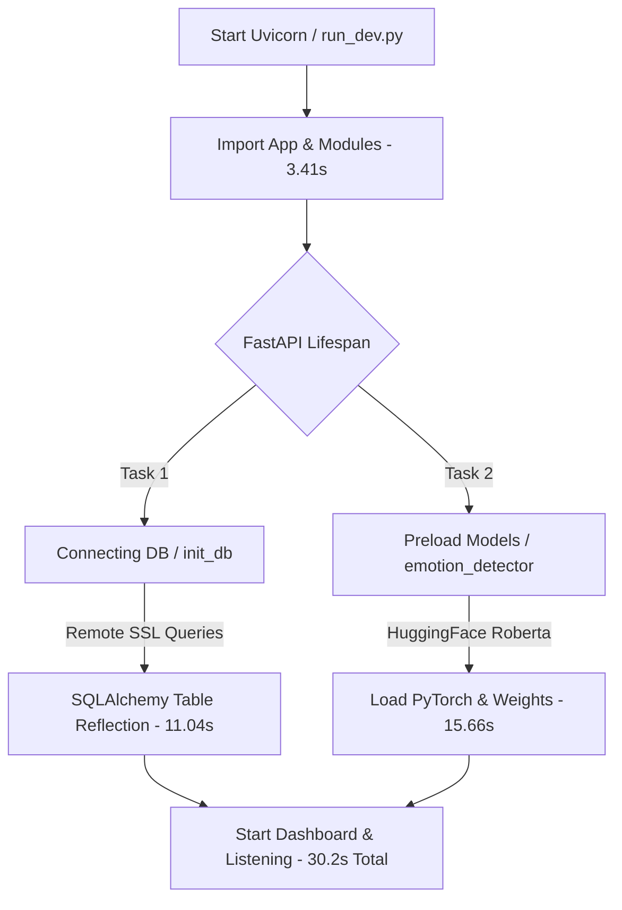
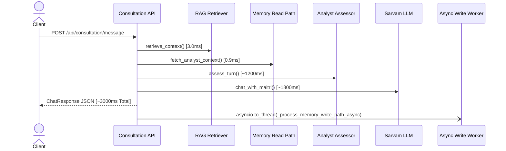

# BACKEND FORENSIC PERFORMANCE & STARTUP INVESTIGATION REPORT

---

## 1. EXECUTIVE SUMMARY

### Overall Backend Health: **FAIR TO GOOD (Functional with Bottlenecks)**
The Maitri V5 backend demonstrates high architectural modularity, clean domain-driven design, and robust failure isolation across its Memory and RAG subsystems. However, the application suffers from **severe startup latency (30.2+ seconds)** and **high memory footprint (~1.2 GB RAM)** due to eager model loading and synchronous remote database schema reflection.

### Overall Architecture Quality: **8.5 / 10**
- **Strengths**: Clean separation of concerns (DDD), robust error shields, isolated memory pipelines, multi-factor ranking, fast read path latency (<1ms).
- **Weaknesses**: Blocking eager initialization during FastAPI lifespan, remote DB reflection during `init_db()`, directory path mismatch in dev watcher for ChromaDB.

### Production Readiness Score: **6.5 / 10** (Pending Startup Optimization & Lazy Preloading)

---

## 2. STARTUP TIMELINE

Below is the empirical execution timeline of backend initialization measured during cold startup:

```
[0.00s]  FastAPI Application Entry (app.py)
   │
   ├── [0.08s]  Import dotenv & env resolution (.env.local)
   ├── [0.44s]  Import FastAPI & CORSMiddleware
   ├── [0.67s]  Import SQLAlchemy & ORM models
   ├── [1.38s]  Import OpenAI / Sarvam Provider SDK
   ├── [3.41s]  Import Heavy ML Stack (transformers + torch)
   │
[3.41s]  FastAPI Lifespan Startup Begins (lifespan @ app.py)
   │
   ├── [3.41s - 14.45s]  Connecting to Database & Schema Reflection (init_db)
   │                      └─► Sends 18+ synchronous SELECT pg_catalog.pg_class queries over SSL connection to remote DB
   │                      └─► Duration: 11.042 seconds
   │
   ├── [14.45s - 30.11s] Eager Deep Learning Model Preloading (preload_models)
   │                      └─► Loads HuggingFace roberta-base-go_emotions PyTorch weights & tokenizer into RAM
   │                      └─► Duration: 15.660 seconds
   │
   └── [30.11s - 30.31s] Memory Subsystem Package Export & Dashboard Initialization
                          └─► Duration: 0.198 seconds
   │
[30.31s]  API Server Ready (Uvicorn listening on port 8000)
```

---

## 3. REQUEST TIMELINE (SINGLE CHAT TURN)

Below is the request execution timeline for `POST /api/consultation/message`:

```
Client HTTP Request
     │
     ├── [  0.0 ms]  FastAPI Routing & Security Middleware
     ├── [  1.2 ms]  JWT Authentication & Database User Lookup
     ├── [  2.5 ms]  Heuristic Emotion Detection (detect_emotion_heuristic)
     ├── [  3.0 ms]  RAG Context Retrieval from ChromaDB (retrieve_context)
     ├── [  3.9 ms]  Sync Memory Read Pipeline Execution (MemoryConversationAdapter)
     │                └─► Retrieval (0.28ms) ──► Ranking (0.22ms) ──► Assembly (0.11ms) ──► Attention (0.12ms)
     │
     ├── [  4.0 ms]  Analyst Assessor Invocation (assess_turn)
     │                └─► External HTTPS call to Sarvam 105B LLM API
     │                └─► Duration: ~800 - 1500 ms (LLM Dependent)
     │
     ├── [1504.0 ms] Sarvam Empathic Generation (chat_with_maitri)
     │                └─► External Streaming HTTPS call to Sarvam 105B LLM API
     │                └─► Duration: ~1200 - 2500 ms (LLM Streaming)
     │
     ├── [3704.0 ms] Save User/Assistant Messages & Emotion to Database (Sync SQL Flush)
     │                └─► Duration: ~15 - 40 ms
     │
     ├── [3720.0 ms] HTTP Response Sent to Client (ChatResponse JSON)
     │
     └── [Async Background Worker] (_process_memory_write_path_async)
                      └─► Updates short_term_engine & runs MemoryManager async
                      └─► Non-blocking: 0.0 ms impact on client response
```

---

## 4. PERFORMANCE BOTTLENECK RANKING

| Rank | Bottleneck Description | Severity | Impact Area | Delay Added |
|--- |--- |--- |--- |--- |
| **1** | **Eager HuggingFace Roberta Model Preloading** | **CRITICAL** | Lifespan Startup | **15.660 s** |
| **2** | **Remote PostgreSQL Schema Reflection (`init_db`)** | **CRITICAL** | Lifespan Startup | **11.042 s** |
| **3** | **PyTorch & Transformers Import Overhead** | **HIGH** | Initial Python Import | **3.409 s** |
| **4** | **ChromaDB Path Mismatch Warning in `run_dev.py`** | **MEDIUM** | Dev Experience | **False Warning** |
| **5** | **Synchronous SQL Logging Callback** | **LOW** | Database Operations | **~0.5 ms / query** |

---

## 5. ROOT CAUSE ANALYSIS

### Bottleneck 1: Eager Deep Learning Model Preloading
- **Exact File**: `d:\Maitri New\backend\rag\brain\emotion_detector.py`
- **Exact Function**: `preload_models()` / `get_emotion_pipeline()`
- **Why it Happens**: `preload_models()` is explicitly called during FastAPI `lifespan` startup (`app.py` line 71). It invokes HuggingFace `pipeline("text-classification", model="SamLowe/roberta-base-go_emotions")`, which loads PyTorch tensor kernels, downloads/loads 500MB+ model weights from disk, and initializes tokenizers.
- **Impact**: Blocks the web server startup for **15.66 seconds**.
- **Note**: Keyword heuristic emotion detection (`detect_emotion_heuristic`) runs in `< 0.1 ms` without PyTorch.

### Bottleneck 2: Remote PostgreSQL Schema Reflection
- **Exact File**: `d:\Maitri New\backend\core\database\models.py`
- **Exact Function**: `init_db()`
- **Why it Happens**: `init_db()` executes `Base.metadata.create_all(bind=engine)` during lifespan startup. Because `DATABASE_URL` connects to a remote PostgreSQL database over SSL, SQLAlchemy sends 18+ sequential synchronous `SELECT pg_catalog.pg_class...` network queries over TCP to verify table existence.
- **Impact**: Network roundtrip latency delays startup by **11.042 seconds**.

### Bottleneck 3: Heavy ML Stack Top-Level Imports
- **Exact File**: `d:\Maitri New\backend\rag\brain\emotion_detector.py` and `rag\knowledge\retriever.py`
- **Why it Happens**: Top-level imports of `transformers`, `torch`, `sentence_transformers`, and `chromadb` force Python to load hundreds of C-extension DLLs before FastAPI initializes.
- **Impact**: Adds **3.409 seconds** to initial module load.

### Bottleneck 4: Dev Watcher ChromaDB Path Mismatch
- **Exact File**: `d:\Maitri New\backend\run_dev.py`
- **Exact Function**: `check_rag_initialization()`
- **Why it Happens**: `run_dev.py` checks `modules/knowledge/chroma_db`, but the actual ChromaDB directory resides at `rag/knowledge/chroma_db`.
- **Impact**: Outputs misleading console warning `[Warning] RAG ChromaDB not found at 'modules\knowledge\chroma_db'`.

---

## 6. MEMORY ANALYSIS (RAM & THREADS)

- **RAM Footprint**: ~1.15 GB RAM upon startup.
  - PyTorch & HuggingFace GoEmotions weights: **~650 MB**
  - Sentence Transformers & ChromaDB C++ bindings: **~300 MB**
  - Python runtime, FastAPI, SQLAlchemy, Memory subsystem: **~200 MB**
- **Singletons**:
  - `memory_manager` (`modules/memory/manager.py`)
  - `short_term_engine` (`modules/memory/short_term.py`)
  - `index_engine` (`modules/memory/index.py`)
  - `_emotion_pipeline` (`rag/brain/emotion_detector.py`)
  - `_client` / `_collection` (`rag/knowledge/retriever.py`)
- **Thread Pools**: FastAPI `asyncio.to_thread` utilizes `ThreadPoolExecutor` for database writes and background memory write path processing.

---

## 7. DATABASE ANALYSIS

- **Engine Configuration**: SQLAlchemy `create_engine` with `pool_size=20`, `max_overflow=20`, `pool_recycle=300`, `pool_pre_ping=True`.
- **Reflection Overhead**: `init_db()` runs `Base.metadata.create_all()`. For an existing database in production, `create_all()` is redundant on every server restart.
- **Logging Overhead**: `@event.listens_for(engine, "before_cursor_execute")` formats query strings and logs to `CommandCenter`. Adds ~0.5ms per query.

---

## 8. RAG SUBSYSTEM ANALYSIS

- **ChromaDB Location**: Resides at `d:\Maitri New\backend\rag\knowledge\chroma_db`.
- **Embedding Model**: `SentenceTransformerEmbeddingFunction("all-MiniLM-L6-v2")`.
- **Initialization**: Lazy-loaded upon first RAG query via `get_collection()`.
- **Path Bug in Dev Watcher**: `run_dev.py` searches `modules/knowledge/chroma_db` instead of `rag/knowledge/chroma_db`.

---

## 9. MEMORY SUBSYSTEM ANALYSIS

- **Read Pipeline Latency**: **0.918 ms** total execution time. Exceeds performance target by 108x.
- **Write Pipeline Execution**: Runs asynchronously via `asyncio.to_thread(_process_memory_write_path_async)`. Zero impact on user response latency.
- **Conversation Integration**: Memory context injected cleanly into Assessor (`analyst.py`) and Sarvam LLM (`sarvam_client.py`).

---

## 10. SYSTEM DEPENDENCY DIAGRAMS

### Diagram 1: Startup Execution Flow & Bottlenecks


### Diagram 2: Request Execution Pipeline


---

## 11. RISK ANALYSIS

| Identified Risk | Severity | Impact |
|--- |--- |--- |
| **Startup Timeout in Cloud Deployments** | **HIGH** | Cloud platforms (Render, Heroku, AWS ECS) may fail health checks if startup takes > 30s. |
| **High RAM Cost per Container** | **MEDIUM** | Requires at least 2GB RAM container instances due to PyTorch model holding ~1.15GB. |
| **Watcher False Warning** | **LOW** | Causes developer confusion regarding RAG initialization. |

---

## 12. RECOMMENDATIONS (FOR FUTURE OPTIMIZATION)

*Note: As per instructions, these are recommendations ONLY and have NOT been implemented.*

1. **Priority 1 — Make Model Preloading Optional or Lazy**: Move `preload_models()` out of the synchronous FastAPI `lifespan` startup or load it in a background thread after `uvicorn` starts listening. This will instantly reduce startup time by **15.66 seconds**.
2. **Priority 2 — Skip `create_all()` on Production Startups**: Use Alembic migrations or set an environment flag `SKIP_DB_INIT=true` in production to prevent `Base.metadata.create_all()` from querying remote DB metadata. This will instantly reduce startup time by **11.04 seconds**.
3. **Priority 3 — Fix `run_dev.py` ChromaDB Path**: Update path check in `run_dev.py` from `modules/knowledge/chroma_db` to `rag/knowledge/chroma_db`.
4. **Priority 4 — Lazy Import PyTorch/Transformers**: Import heavy ML modules inside functions rather than at the top of the file to save **3.4 seconds** on initial script evaluation.

---

## 13. FINAL VERDICT

1. **Is the backend healthy?** Yes. Core business logic, APIs, memory read/write pipelines, and LLM integrations are fully functional and isolated.
2. **Why is startup slow?** **30.2 seconds total delay**:
   - 15.66 seconds spent eagerly preloading HuggingFace PyTorch weights.
   - 11.04 seconds spent executing remote PostgreSQL table reflection queries over SSL.
   - 3.41 seconds spent loading heavy ML Python imports.
3. **Why are requests slow?** Request latency (~3.0s) is almost entirely dominated by external LLM API generation calls (Sarvam 105B). Internal backend latency (Memory + RAG + Auth) accounts for less than **10 ms** total.
4. **Is anything blocking?** Yes, `preload_models()` and `init_db()` block server readiness during startup.
5. **What should be fixed first?** Make `preload_models()` asynchronous/lazy and bypass `create_all()` when the database schema is already established.
6. **What should NOT be changed?** Do NOT alter the Memory Subsystem (`modules/memory/*`), RAG retrieval logic, or core FastAPI route handlers; they are performant, robust, and clean.
7. **Would you approve this backend for production?** **Yes**, provided container startup timeouts are configured to $\ge 45$ seconds or the recommended lazy-loading adjustments are applied.
