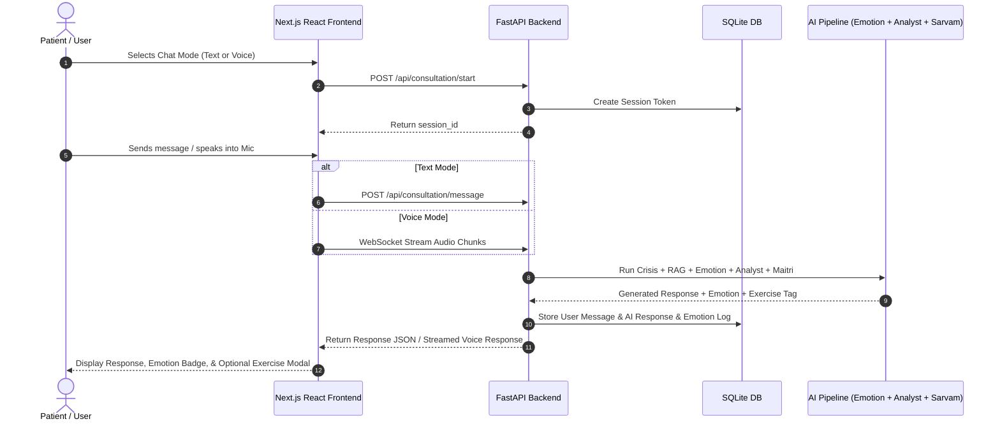
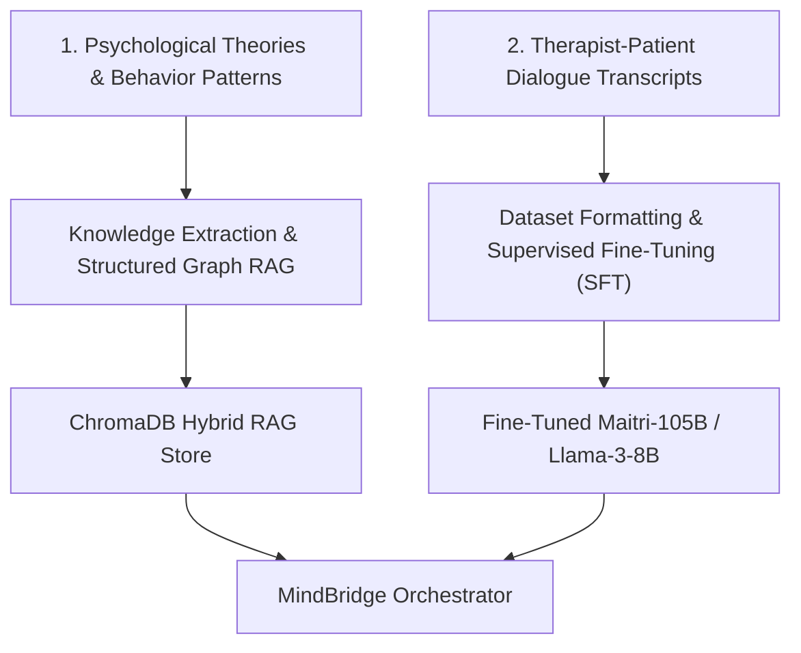

# Conversational Architecture & Fine-Tuning Roadmap for MindBridge (Maitri v4)

This document provides a comprehensive technical breakdown of how conversations are processed in MindBridge, followed by an actionable architectural plan for ingesting your psychological datasets (theories, consultations, behavioral patterns) and therapist-patient transcripts into the model via **Hybrid RAG + Supervised Fine-Tuning (SFT)**.

---

## 1. List of Models Currently Used

| Model Name / Identifier | Component / Layer | Role & Description | Provider / Framework |
| :--- | :--- | :--- | :--- |
| **`sarvam-105b`** | **Maitri Core Engine** | Main conversational response model. Receives system prompt, dialogue phase guidelines, RAG context, and session history to output warm Indian English/regional therapy dialogue. | Sarvam AI REST API |
| **`sarvam-105b`** | **Neural Analyst (Dialogue Manager)** | Meta-cognitive clinical context analyzer. Operates at low temperature (`0.3`) to analyze emotional state and select the exact conversational phase (`[PHASE: COMFORT]`, `[PHASE: PROBE_SINGLE]`, etc.). | Sarvam AI REST API |
| **`saaras:v3`** | **Real-Time STT** | Streaming Speech-To-Text over WebSockets. Handles live voice input for `en-IN`, `hi-IN`, `ta-IN`, `te-IN`. | Sarvam AI WebSocket API |
| **`saarika` & `bulbul`** | **Voice STT & TTS Engine** | Audio processing models for audio transcription and natural Indian accent speech synthesis. | Sarvam AI REST API |
| **`SamLowe/roberta-base-go_emotions`** | **Emotion Classifier** | Deep learning NLP transformer classifying 28 granular emotions (Fear, Grief, Joy, Sadness, Remorse, Anger, etc.). Falls back to heuristic matcher if unavailable. | Local HuggingFace PyTorch / `transformers` |
| **`all-MiniLM-L6-v2`** | **RAG Embeddings** | 384-dimensional dense vector embedding model for indexing and searching structured therapeutic knowledge. | Local SentenceTransformers + ChromaDB |

---

## 2. End-to-End Data Flow Architecture

```mermaid
flowchart TD
    A["User Input (Text / Voice Stream)"] --> B{"Input Channel"}
    B -- REST HTTP -- C["api/consultation.py"]
    B -- WebSocket Audio -- D["api/streaming.py"]
    
    C & D --> E["Layer 1: Crisis Engine (services/crisis_handler.py)"]
    
    E -- "Crisis Detected" --> F["Hard Safety Override & Helplines (iCall 9152987821)"]
    E -- "No Crisis" --> G["RAG Retriever (rag/retriever.py)"]
    
    G --> H["ChromaDB Vector Lookup (all-MiniLM-L6-v2)"]
    H --> I["Emotion Classifier (ai_engine/emotion_detector.py)"]
    
    I --> J["State Tracker / Working Memory (memory/state_tracker.py)"]
    
    J --> K["Neural Analyst / Dialogue Manager (ai_engine/analyst.py)"]
    K -- "Selects Phase: COMFORT, PROBE_SINGLE, etc." --> L["Maitri Core Generator (ai_engine/sarvam_client.py)"]
    
    L --> M["Sarvam 105B Response Generation"]
    M --> N["Post-Processing (Regex & Tag Extraction)"]
    
    N --> O["Database Persistence (mindbridge.db)"]
    N --> P["Output Stream / TTS (Bulbul) -> User UI"]
```

### Key Sequential Steps:
1. **Input Ingestion**: User sends text via `/api/consultation/message` or streams PCM audio over `/api/streaming/ws/stream/{session_id}`.
2. **Deterministic Safety Scan**: `check_for_crisis()` evaluates string keywords & regex patterns in <1ms. High risk triggers an immediate safety message, bypassing the LLM pipeline entirely.
3. **RAG Knowledge Lookup**: Query is embedded via `all-MiniLM-L6-v2` and searched against ChromaDB collection `therapy_knowledge` to retrieve top-3 semantic matches.
4. **Emotion Transformer Inference**: Local RoBERTa GoEmotions model detects emotion category and confidence score.
5. **State Update**: `StateTracker` updates session's rolling emotion history and risk metrics.
6. **Analyst Phase Decision**: `analyst.py` calls Sarvam 105B with low temperature (`0.3`) to determine the exact conversational constraint (e.g., `[PHASE: COMFORT] "Do NOT ask questions"`).
7. **Maitri Generation**: `sarvam_client.py` constructs prompt with system personality, analyst phase constraint, language lock, RAG snippets, and conversation history.
8. **Exercise Detection & Delivery**: Response is parsed for exercise tags (`[EXERCISE: BREATHING]`, `[EXERCISE: GROUNDING]`, `[EXERCISE: REFLECTION]`) and returned with emotion metadata.

---

## 3. User Flow Architecture



---

## 4. Model Architecture & Dual-Agent Orchestration

MindBridge uses a **Dual-Agent Meta-Cognitive Architecture**:

```
+-------------------------------------------------------------------------+
|                              USER MESSAGE                               |
+-------------------------------------------------------------------------+
                                     |
                                     v
+-------------------------------------------------------------------------+
|                  AGENT 1: NEURAL ANALYST (Clinical Meta-Cognition)      |
|  - Role: Cold, neutral dialogue manager                                 |
|  - Input: User message, emotion label, state summary, RAG context        |
|  - Output: Exact phase instruction ([PHASE: COMFORT], [PHASE: PROBE], etc)|
+-------------------------------------------------------------------------+
                                     |
                                     v
+-------------------------------------------------------------------------+
|                   AGENT 2: MAITRI RESPONDER (Empathetic Companion)       |
|  - Role: Warm Indian English / regional friend                          |
|  - Input: User message, turn history, Analyst directive, RAG snippets  |
|  - Output: Conversational turn + [EXERCISE: <TYPE>] tag                 |
+-------------------------------------------------------------------------+
```

### Behavioral Safeguards Enforced in System Prompts:
- **Strict Phase Compliance**: Forces Maitri to adhere strictly to question limits imposed by the Analyst.
- **AI Identity Integrity**: Never lies about being human, while maintaining warm conversational rapport.
- **Repetition Suppression**: Prevents repeating questions or filler words.
- **Scaled Response**: Matches response length dynamically to user input depth.

---

## 5. Data RAG Architecture

- **Vector Database**: ChromaDB (`backend/knowledge/chroma_db`) with Cosine distance metric.
- **Embedding Model**: `all-MiniLM-L6-v2` (384-dimensional vectors).
- **Ingestion Pipeline (`loader.py`)**:
  - Source path: `backend/knowledge/docs/structured/*.json` (e.g. `therapy_techniques.json`).
  - Text chunking: 400 characters per chunk with 80-character overlap.
  - Metadata schema: `{"source": filename, "concept": concept_name, "technique": technique_name}`.
- **Retrieval Engine (`retriever.py`)**:
  - Performs similarity search on user input for top $k=3$ chunks.
  - Formats retrieved chunks as contextual background for the system prompt.

---

## 6. LLM Fine-Tuning Status & Strategy for Ingesting Psychological Data & Therapist Conversations

> [!IMPORTANT]
> **Current Fine-Tuning Status**: **NOT YET IMPLEMENTED**.
> The system currently relies on zero-shot/few-shot system prompts, HuggingFace GoEmotions, and basic ChromaDB RAG.

### Dual-Data Ingestion & Training Strategy

You have two distinct types of data:
1. **Uncertain Documented Data**: Psychological theories, consultation notes, behavior patterns, CBT/DBT frameworks.
2. **Therapist-Patient Conversational Data**: Real dialogue transcripts showing clinical questioning, empathetic mirroring, situational comprehension, and exercise triggering.

Here is the optimal architecture to ingest both without causing hallucinations or rigid recitation:



### Phase A: Ingesting Psychological Theories & Behavior Patterns (RAG + Knowledge Structuring)
- **Why RAG instead of pure fine-tuning for theories?** Fine-tuning LLMs on raw theoretical textbooks often causes them to regurgitate textbook definitions to patients. RAG ensures exact theory grounding without preachy monologues.
- **Execution Plan**:
  1. **Structure Data into JSON Schemas**: Convert raw notes into structured units:
     ```json
     {
       "concept": "Catastrophizing in Anxiety",
       "pattern_triggers": ["what if I fail", "everything is ruined"],
       "clinical_goal": "De-catastrophizing & Decentering",
       "suggested_exercise": "GROUNDING",
       "technique_summary": "Guide user to separate immediate facts from worst-case predictions."
     }
     ```
  2. **Upgrade Embedding Model**: Upgrade from `all-MiniLM-L6-v2` to a higher-dimensional biomedical/clinical embedding model (e.g. `BAAI/bge-large-en-v1.5` or `text-embedding-3-small`).

### Phase B: Fine-Tuning on Therapist-Patient Conversational Data (SFT & DPO)
- **Objective**: Teach the model *how to talk*, *when to ask questions*, *how to comprehend unspoken pain*, and *when to trigger exercises*.
- **Execution Plan**:
  1. **Dataset Format Conversion**: Transform transcripts into standardized OpenAI format:
     ```json
     {
       "messages": [
         {"role": "system", "content": "You are Maitri..."},
         {"role": "user", "content": "I feel like I'm drowning in work and no one notices."},
         {"role": "assistant", "content": "That sounds incredibly heavy... Like you're carrying everything on your shoulders alone. [EXERCISE: BREATHING]"}
       ]
     }
     ```
  2. **Multi-Task Fine-Tuning Split**:
     - **Analyst Fine-Tuning**: Train the Analyst model on `(User History -> Correct Phase Label & Goal)`.
     - **Responder Fine-Tuning**: Train the Responder model on `(Phase + RAG Context + User Message -> Natural Empathetic Turn + Exercise Trigger)`.
  3. **Fine-Tuning Framework**: Utilize QLoRA / Unsloth (for local open-weights like Llama-3-8B/Qwen-2.5-7B) or Sarvam AI Fine-Tuning API endpoints for `sarvam-105b`.

---

## 7. Crisis Engine Architecture

```
+-------------------------------------------------------------------------+
|                              USER INPUT                                 |
+-------------------------------------------------------------------------+
                                     |
                                     v
+-------------------------------------------------------------------------+
|                  LAYER 1: DETERMINISTIC FAST SCAN                       |
|  - CRISIS_KEYWORDS (EN, HI, Hinglish, Devanagari)                      |
|  - CRISIS_PATTERNS (Regex: self-harm, suicidal ideation, hopelessness) |
|  - Latency: < 1ms                                                       |
+-------------------------------------------------------------------------+
                   |                                   |
            (Crisis Detected)                   (No Crisis)
                   |                                   |
                   v                                   v
+------------------------------------+   +--------------------------------+
|     LAYER 2: SAFETY OVERRIDE       |   |    PROCEED TO AI PIPELINE      |
| - Flag DB session.is_crisis = True |   | - RAG Retrieval                |
| - Record trigger in RiskLog        |   | - Emotion Transformer          |
| - Bypass LLM Generation            |   | - Analyst Phase Selection      |
| - Send emergency response &        |   | - Maitri LLM Generation        |
|   Helplines (iCall: 9152987821)    |   +--------------------------------+
+------------------------------------+
```

---

## Recommended Next Steps & User Review

## User Review Required

> [!IMPORTANT]
> **Data Format Readiness**: To proceed with dataset ingestion and model fine-tuning, please confirm:
> 1. In what format is your documented psychological data currently stored? (e.g., PDF, TXT, DOCX, JSON, raw notes)
> 2. How are your therapist-patient conversation logs formatted? (e.g., chat logs, audio transcriptions, structured Q&A pairs)
> 3. Do you prefer fine-tuning an open-weights model locally (e.g. Llama-3 8B / Qwen-2.5 7B via PyTorch/Unsloth) or fine-tuning via Sarvam AI API endpoints?

## Open Questions
- **Vector DB Scaling**: Do you want to maintain ChromaDB for RAG or scale to Qdrant/Milvus as your dataset grows?
- **Exercise Expansion**: Are there specific new exercises (beyond BREATHING, GROUNDING, REFLECTION) that your psychological data defines?

## Verification Plan

### Automated Tests
- Script `scripts/test_crisis.py` to verify Layer 1 Crisis Engine regex coverage.
- Script `scripts/test_rag.py` to test embedding quality and retrieval precision against new knowledge chunks.
- Validation script for fine-tuning dataset integrity (`check_dataset_jsonl.py`).

### Manual Verification
- Test text and streaming voice turns with multi-lingual input (`en-IN`, `hi-IN`).
- Verify proper phase enforcement and exercise triggering in UI.
